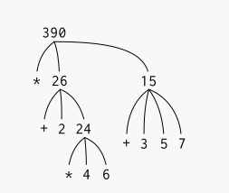

# 1.1.3 Avaliando Combinações
Um de nossos objetivos neste capítulo é isolar questões sobre o pensamento procedural. Um exemplo é considerar que, ao avaliar combinações, o interpretador está, por sua vez, seguindo um procedimento.

Para avaliar uma combinação, faça o seguinte:

Avalie as subexpressões da combinação.

Aplique o procedimento que é o valor da subexpressão mais à esquerda (o operador) aos argumentos que são os valores das outras subexpressões (os operandos).

Mesmo esta regra simples ilustra alguns pontos importantes sobre processos em geral. Primeiro, observe que o primeiro passo dita que, para realizar o processo de avaliação de uma combinação, devemos primeiro executar o processo de avaliação em cada elemento da combinação. Assim, a regra de avaliação é de natureza recursiva; ou seja, inclui, como um de seus passos, a necessidade de invocar a própria regra.

Note quão sucintamente a ideia de recursão pode ser usada para expressar o que, no caso de uma combinação profundamente aninhada, seria visto de outra forma como um processo bastante complicado. Por exemplo, avaliando:

O Capítulo 3 mostrará que essa noção de ambiente é crucial, tanto para entender como o interpretador funciona quanto para implementar interpretadores.

10. Avaliando o Elemento Mais à Esquerda
Pode parecer estranho que a regra de avaliação diga, como parte do primeiro passo, que devemos avaliar o elemento mais à esquerda de uma combinação, já que neste ponto ele só pode ser um operador como + ou * representando um procedimento primitivo embutido como adição ou multiplicação. Veremos mais tarde que é útil poder trabalhar com combinações cujos operadores são eles próprios expressões compostas.

Figura 1.1: Representação em árvore, mostrando o valor de cada subcombinação.

                               390
                              /   \
                             *     15
                             |    / | \
                             |   3  5  7
                             |
                             26
                           /    \
                          +      24
                         / \      |
                        2   24    *
                                  / \
                                 4   6

Lisp

(* (+ 2 (* 4 6))
   (+ 3 5 7))

requer que a regra de avaliação seja aplicada a quatro combinações diferentes. Podemos obter uma imagem desse processo representando a combinação na forma de uma árvore, como mostrado na Figura 1.1. Cada combinação é representada por um nó com ramificações correspondentes ao operador e aos operandos da combinação que se originam dele. Os nós terminais (ou seja, nós sem ramificações que partem deles) representam operadores ou números. Visualizando a avaliação em termos da árvore, podemos imaginar que os valores dos operandos percolam para cima, começando nos nós terminais e então se combinando em níveis cada vez mais altos. Em geral, veremos que a recursão é uma técnica muito poderosa para lidar com objetos hierárquicos e semelhantes a árvores. Na verdade, a forma "percolar valores para cima" da regra de avaliação é um exemplo de um tipo geral de processo conhecido como acumulação em árvore.

Em seguida, observe que a aplicação repetida do primeiro passo nos leva ao ponto em que precisamos avaliar, não combinações, mas expressões primitivas como numerais, operadores embutidos ou outros nomes. Cuidamos dos casos primitivos estipulando que:

O valor dos numerais são os números que eles nomeiam,
O valor dos operadores embutidos são as sequências de instruções de máquina que realizam as operações correspondentes, e
O valor de outros nomes são os objetos associados a esses nomes no ambiente.

Podemos considerar a segunda regra como um caso especial da terceira, estipulando que símbolos como + e * também estão incluídos no ambiente global e estão associados às sequências de instruções de máquina que são seus "valores". O ponto chave a ser notado é o papel do ambiente na determinação do significado dos símbolos nas expressões. Em uma linguagem interativa como o Lisp, é sem sentido falar do valor de uma expressão como (+ x 1) sem especificar qualquer informação sobre o ambiente que forneceria um significado para o símbolo x (ou mesmo para o símbolo +). Como veremos no Capítulo 3, a noção geral do ambiente como fornecedor de um contexto no qual a avaliação ocorre desempenhará um papel importante em nossa compreensão da execução do programa.

Observe que a regra de avaliação dada acima não lida com definições. Por exemplo, avaliar (define x 3) não aplica define a dois argumentos, sendo um o valor do símbolo x e o outro o 3, uma vez que o propósito do define é precisamente associar x a um valor. (Ou seja, (define x 3) não é uma combinação.)

Tais exceções à regra geral de avaliação são chamadas formas especiais (special forms). define é o único exemplo de forma especial que vimos até agora, mas encontraremos outras em breve. Cada forma especial tem sua própria regra de avaliação. Os vários tipos de expressões (cada um com sua regra de avaliação associada) constituem a sintaxe da linguagem de programação. Em comparação com a maioria das outras linguagens de programação, o Lisp tem uma sintaxe muito simples; ou seja, a regra de avaliação para expressões pode ser descrita por uma regra geral simples juntamente com regras especializadas para um pequeno número de formas especiais.