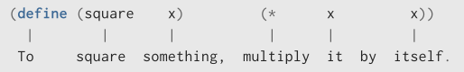

# 1.1.4 Procedimentos Compostos

Identificamos no Lisp alguns dos elementos que devem aparecer em qualquer linguagem de programação poderosa:

Números e operações aritméticas são dados e procedimentos primitivos.

O aninhamento de combinações fornece um meio de combinar operações.

Definições que associam nomes a valores fornecem um meio limitado de abstração.

Agora aprenderemos sobre definições de procedimentos, uma técnica de abstração muito mais poderosa pela qual uma operação composta pode receber um nome e, em seguida, ser referida como uma unidade.

Formas sintáticas especiais que são simplesmente alternativas de superfície convenientes para coisas que podem ser escritas de maneiras mais uniformes são às vezes chamadas de açúcar sintático (syntactic sugar), usando uma frase cunhada por Peter Landin.
Em comparação com os usuários de outras linguagens, os programadores Lisp, via de regra, estão menos preocupados com questões de sintaxe. (Em contraste, examine qualquer manual Pascal e observe o quanto dele é dedicado a descrições de sintaxe.)
Esse desdém pela sintaxe se deve, em parte, à flexibilidade do Lisp, que torna fácil alterar a sintaxe de superfície, e em parte à observação de que muitas construções sintáticas "convenientes", que tornam a linguagem menos uniforme, acabam causando mais problemas do que valem quando os programas se tornam grandes e complexos.
Nas palavras de Alan Perlis:
"Açúcar sintático causa câncer de ponto e vírgula."

Começamos examinando como expressar a ideia de "elevar ao quadrado". Poderíamos dizer: "Para elevar algo ao quadrado, multiplique-o por si mesmo." Isso é expresso em nossa linguagem como:

(define (square x) (* x x))

Podemos entender isso da seguinte forma:

"Para elevar algo ao quadrado, multiplique-o por si mesmo."

Temos aqui um procedimento composto, que recebeu o nome square (quadrado). O procedimento representa a operação de multiplicar algo por si mesmo. A coisa a ser multiplicada recebe um nome local, x, que desempenha o mesmo papel que um pronome na linguagem natural. A avaliação da definição cria este procedimento composto e o associa ao nome square.

A forma geral de uma definição de procedimento é:

(define (<nome> <parâmetros formais>)
  <corpo>)

O <nome> é um símbolo a ser associado à definição do procedimento no ambiente. Os <parâmetros formais> são os nomes usados dentro do corpo do procedimento para se referir aos argumentos correspondentes do procedimento. O <corpo> é uma expressão que fornecerá o valor do procedimento quando ele for aplicado.

12. Criação vs. Nomenclatura de Procedimentos. Observe que há duas operações diferentes sendo combinadas aqui: estamos criando o procedimento e estamos dando a ele o nome square. É possível, e de fato importante, ser capaz de separar estas duas noções: criar procedimentos sem nomeá-los e dar nomes a procedimentos que já foram criados. Veremos como fazer isso na Seção 1.3.2.
13. Notação Sintática Geral. Ao longo deste livro, descreveremos a sintaxe geral das expressões usando símbolos em itálico delimitados por colchetes angulares — por exemplo, $\langle \text{nome} \rangle$ — para denotar os "espaços" na expressão a serem preenchidos quando tal expressão for realmente utilizada.

a aplicação do procedimento quando os parâmetros formais são substituídos pelos argumentos reais aos quais o procedimento é aplicado. O $\langle \text{nome} \rangle$ e os $\langle \text{parâmetros formais} \rangle$ são agrupados entre parênteses, exatamente como seriam em uma chamada real ao procedimento que está sendo definido.Tendo definido square, podemos agora usá-lo:
(square 21)
441

(square (+ 2 5))
49

(square (square 3))
81

Também podemos usar square como um bloco de construção na definição de outros procedimentos. Por exemplo, $x^2 + y^2$ pode ser expressa como:

(+ (square x) (square y))

Podemos facilmente definir um procedimento sum-of-squares que, dados quaisquer dois números como argumentos, produz a soma de seus quadrados:

(define (sum-of-squares x y)
  (+ (square x) (square y)))
(sum-of-squares 3 4)
25

Agora podemos usar sum-of-squares como um bloco de construção na criação de outros procedimentos:

(define (f a)
  (sum-of-squares (+ a 1) (* a 2)))
(f 5)
136

De forma mais geral, o corpo do procedimento pode ser uma sequência de expressões. Neste caso, o interpretador avalia cada expressão na sequência, uma por vez, e retorna o valor da expressão final como o valor da aplicação do procedimento.

Procedimentos compostos são utilizados exatamente da mesma maneira que os procedimentos primitivos. Na verdade, não seria possível dizer, apenas olhando para a definição de sum-of-squares dada anteriormente, se square foi embutido no interpretador, como + e *, ou se foi definido como um procedimento composto.